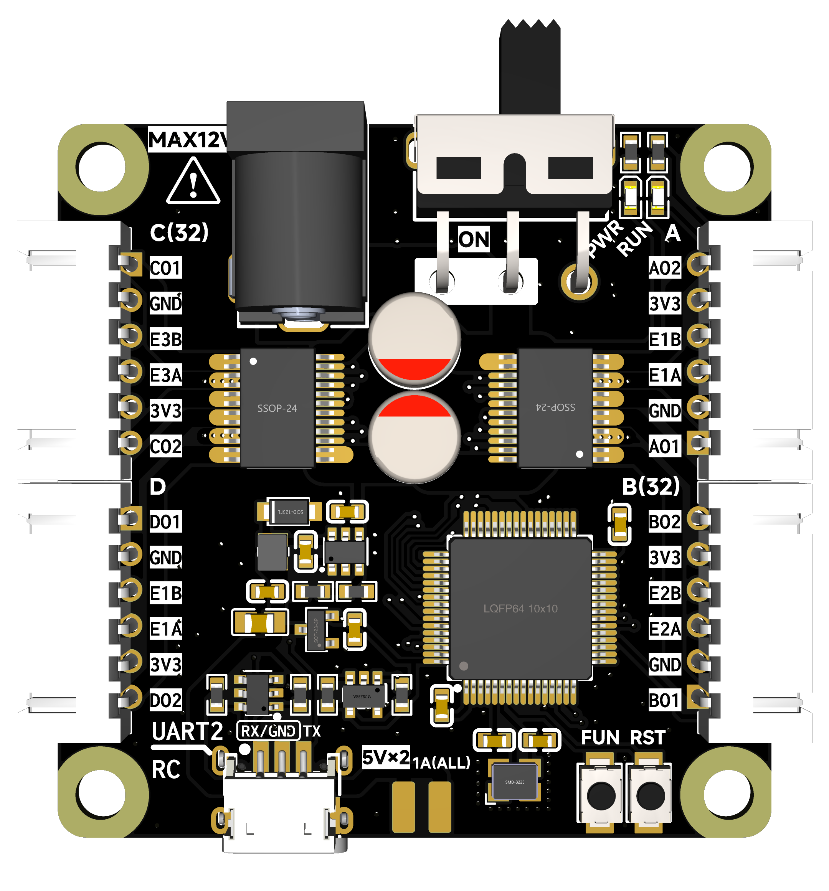
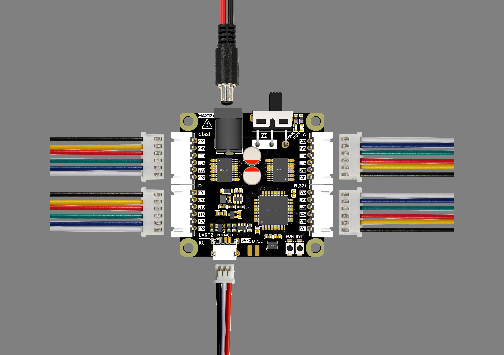
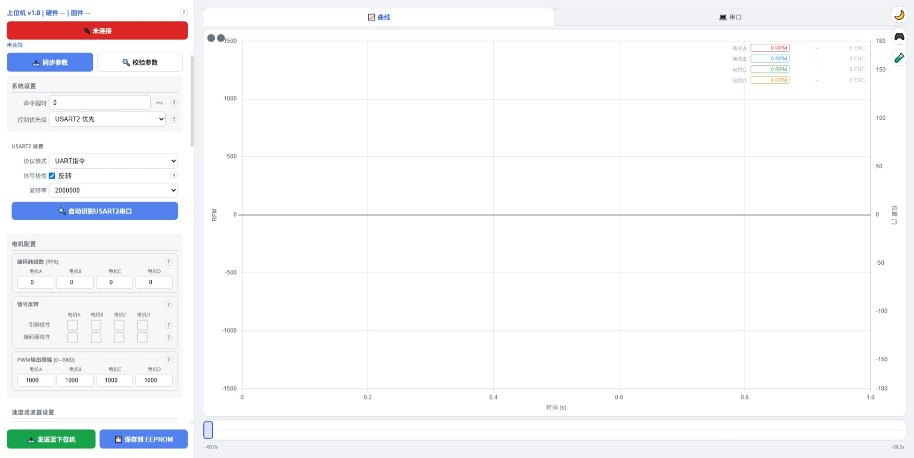

# Motor Driver Controller — 技术手册

> **产品：** 基于 STM32F401 + TB6612 的四路带编码器直流电机驱动器  
> **手册版本：** v1.2  
> **适用范围：** 硬件 v**1.1**.x | 固件 v**1.1**.x | 上位机 v**1**.x  
> **版本说明：** [5.8 版本体系](#58-版本体系)

---

> **修订版本：** v1.2  
> **修订时间：** 2026-08-27  
> **修订记录：** [附录D. 手册修订记录](#d-手册修订记录)

---

<div align="center"></div>

---

## 目录

- [1. 产品概述](#1-产品概述)
- [2. 技术规格与电气属性](#2-技术规格与电气属性)
- [3. 硬件接口与引脚定义](#3-硬件接口与引脚定义)
- [4. 固件功能说明](#4-固件功能说明)
- [5. 通信协议](#5-通信协议)
- [6. 快速上手](#6-快速上手)
- [7. 固件更新（OTA）](#7-固件更新ota)
- [8. 故障排查](#8-故障排查)
- [9. 附录](#9-附录)

---

## 1. 产品概述

Motor Driver Controller 是四路直流电机驱动器，内置 PID 闭环算法，支持 SBUS 遥控器、ELRS（ExpressLRS，CRSF 帧格式）遥控器与 UART 串口三种控制方式，可通过浏览器（Web Serial）进行参数配置、实时监控与固件升级。

| 特性 | 说明 |
|------|------|
| 电机通道 | 4 路独立直流电机（2× TB6612FNG 双路 H 桥） |
| 编码器接口 | 4 路正交编码器，硬件 4× 倍频，无内置上拉电阻，不支持开漏输入编码器 |
| 控制协议 | SBUS（100kbps 8E2）/ ELRS·CRSF（420kbps 8N1）/ UART 文本指令 / UART 二进制帧 |

> **关于 SBUS 与 ELRS：** 二者是两种独立遥控串行协议（品牌与帧格式的区分详见 §5.9），通道映射 / 映射模式 / 方向映射 / 行程映射 / 通道值域范围（`/smap`、`/rmap`、`/dmap`、`/sbusparam`、`/sbusrange`）对 SBUS 与 ELRS 完全共用。同一套遥控通道设置可无缝切换控制源。
| 闭环模式 | 开环 / 速度闭环 / 位置闭环，每通道独立 |
| PID 类型 | 位置式 / 增量式，每通道可选（速度环、位置环独立配置） |
| 配置存储 | 板上 EEPROM 保存全部配置，开机自动加载 |
| 调试接口 | USB Type-C 虚拟串口（CH340N）+ SWD 4-Pin |
| 上位机 | Web 上位机（开源），浏览器直连，支持参数配置 / 实时曲线 / 串口刷写 |

---

## 2. 技术规格与电气属性

### 2.1 硬件规格

| 参数 | 说明 |
|------|------|
| 主控芯片 | STM32F401RCT6（Cortex-M4, 84MHz, 64KB SRAM, 256KB Flash） |
| 电机驱动 | 2× TB6612FNG 双路 H 桥（单路持续 1.2A / 峰值 3.2A，详见 §2.2） |
| 存储 | AD24C02，2K-bit（256B）I2C EEPROM |

### 2.2 电气规格与电源要求

| 参数 | 数值 |
|------|------|
| 输入电压 | DC 5.5V ~ 15V（推荐 7.4V / 11.1V / 12V） |
| 电源极性 | DC-005 2.1mm 插座 |
| 电源架构 | DC IN → LGS5145 Buck → 5V → 662K LDO → 3.3V |
| 逻辑供电 | 3.3V（内部 LDO） |
| 编码器供电 | 3.3V（由板载 LDO 提供） |
| 控制信号电平 | 3.3V / 5V TTL |
| 电机输出电流 | 单路持续 1.2A / 峰值 3.2A（TB6612） |
| 5V 输出 | 5V，两路合计 ≤1A（Buck 上限，与板上负载共享） |
| PWM 频率 | 20kHz（TIM1） |

**电源要求：**

- **输入电压范围：** DC 5.5V ~ 15V（推荐 ≤12V；详见下方极限参数）
- **电源接口：** DC-005 2.1mm（内正外负）
- **推荐电压：** 7.4V（2S 锂电）/ 11.1V（3S 锂电）/ 12V
- **无反向保护：** 板上无反接保护二极管，**接反、过压会损坏电路**，通电前务必确认极性

#### 极限参数（Ta=25°C）

| 对外接口 | 最小 | 最大 | 说明 |
|---------|:---:|:---:|------|
| 总电源输入（VIN） | 5.5V | 15V | 内正外负，无反接保护 |
| 电机输出 | 0V | VIN | 单路持续 1.2A / 峰值 3.2A（TB6612） |
| 编码器供电 | 3.0V | 3.6V | 3.3V 标称，≤300mA（板载 LDO 总量，与板上负载共享） |
| 编码器输入 | 0V | 3.6V | 3.3V 逻辑电平 |
| RC 控制信号输入 | 0V | 5.5V | 3.3V / 5V TTL，由板载异或门中继信号 |
| USB-C 输入 | / | / | Type-C 不参与板载供电 |
| 5V 输出 | 4.75V | 5.25V | 5V，**两路合计 ≤1A**（Buck 上限，与板上负载共享），仅用作传感器、MCU供电，请勿用作舵机等供电高瞬时功率电气供电 |

> **极限电压推导：** 最低输入 5.5V 由 LGS5145 Buck 输出 5V 的降压比下限决定（供电链最苛刻环节）；最高 15V 由 TB6612 VM 极限参数决定。供电链：DC IN → LGS5145 Buck(5V) → 662K LDO(3.3V)。

> **编码器**输入无中继保护，如编码器使用外接供电，请确保供电电源不高于5V

> **RC**接口由异或门中继，故可以接收3V3/5V电平信号

> **任意情况下，都请勿超过以上参数**


### 2.3 机械与连接器规格

**整板尺寸：** 60mm × 60mm

| 连接器 | 规格 | 用途 |
|--------|------|------|
| A/B/C/D | 6-Pin XH 2.5mm 弯插母座 | 每通道电机 + 编码器 |
| RC | 2-Pin 1.5mm 卧贴母座 | SBUS / UART 控制信号（无极性输入） |
| USB | Type-C 母座 | 上位机连接 / 调试 / OTA（不参与板载供电） |
| DC IN | DC-005 2.1mm | 电源输入 |
| 5V 输出 ×2 | 独立端子 | 5V ≤1A 供电输出（传感器 / MCU，勿用于舵机等） |
| SWD | 4-Pin 1.27mm 排针 | 调试接口（3V3/SWDIO/SWCLK/GND） |

> **注意**：连接电机时应检查电机编码器供电3V3与GND接口是否与驱动板上标注的顺序一致！！

---

## 3. 硬件接口与引脚定义

### 3.1 板面布局

| 编号 | 名称 | 类型 | 说明 |
|------|------|------|------|
| ① | A / B / C / D | 6-Pin XH 2.5mm 母座 | 电机 + 编码器连接器 |
| ② | RC | 2-Pin 1.5mm 卧贴母座 | SBUS / UART 控制信号输入（无极性） |
| ③ | USB | Type-C 母座 | USB 调试 / 上位机连接 |
| ④ | DC IN | DC-005 2.1mm | 电源输入（内正外负） |
| ⑤ | SWD | 4-Pin 1.27mm 排针 | SWD 调试接口 |
| ⑥ | LED | 0603 红色 LED | 工作状态指示灯 |
| ⑦ | FUN | 轻触按键 | 见下方按键功能说明 |
| ⑧ | SW1 | 滑动开关 | 电源开关 |
| ⑨ | RST | 轻触按键 | 系统复位 |

**FUN 键功能：**
- 按住 FUN 上电 → 进入 Bootloader（OTA 模式）
- 运行中长按 1 秒 → 协议自动识别（SBUS/UART）

### 3.2 电机连接器（6-Pin XH，A/B/C/D）

| Pin | 名称 | 方向 | 说明 |
|-----|------|------|------|
| 1 | MOTOR_OUT2 | 输出 | TB6612 电机驱动线 2 |
| 2 | GND | — | 编码器电源地 |
| 3 | ENC_A | 输入 | 编码器 A 相信号 |
| 4 | ENC_B | 输入 | 编码器 B 相信号 |
| 5 | +3.3V | 输出 | 编码器供电 |
| 6 | MOTOR_OUT1 | 输出 | TB6612 电机驱动线 1 |

> **线序建议：** Pin3/Pin4 接反会导致编码器方向识别错误，可用 `/inv` 软件反转补偿。

### 3.3 控制信号输入（RC）

**无极性 2-Pin 1.5mm 卧贴插座**，GND 与 SIGNAL 可正反插，支持：
- **SBUS 接收机**：直接插入，FUN 键识别
- **ELRS 接收机**（CRSF 帧格式）：直接插入，FUN 键识别（默认直通不反相）
- **UART TX 信号**：3.3V / 5V TTL 电平，接外部 MCU 的 TX 引脚（需共地）

> RC 接口由板上异或门中继，故可接收 3.3V / 5V 电平信号；RC 仅传信号，**不对外供电**；SBUS / ELRS 接收机需要外部供电（通常接接收机自己的电源）。

### 3.4 调试接口

- **USB Type-C**：CH340N 虚拟串口，固定 **2000000-8N1**，承载上位机通信（文本指令 + 二进制帧）与 OTA 刷写；**仅通信，不参与板载供电**（板载供电仅来自 DC IN）
- **SWD 4-Pin**：3V3 / SWDIO / SWCLK / GND，用于固件级调试

### 3.5 MCU 引脚分配

**电机驱动（IN1/IN2 方向 + PWM 20kHz）：**

| 通道 | IN1 | IN2 | PWM (TIM1) |
|------|-----|-----|------------|
| Motor A | PC12 | PC11 | PA9 (TIM1_CH2) |
| Motor B | PA12 | PC9 | PA8 (TIM1_CH1) |
| Motor C | PA15 | PC10 | PA10 (TIM1_CH3) |
| Motor D | PB4 | PD2 | PA11 (TIM1_CH4) |

**编码器（Encoder Mode，硬件 4× 倍频）：**

| 编码器 | 定时器 | CH1 | CH2 |
|--------|--------|-----|-----|
| Encoder A | TIM3 (16-bit) | PA6 | PA7 |
| Encoder B | TIM5 (32-bit) | PA0 | PA1 |
| Encoder C | TIM2 (32-bit) | PA5 | PB3 |
| Encoder D | TIM4 (16-bit) | PB6 | PB7 |

**通讯与其它：**

| 功能 | 引脚 | 说明 |
|------|------|------|
| 控制输入 | PA3 (USART2 RX) | SBUS / UART，经异或门无极性输入 |
| 极性控制 | PC13 (GPIO) | 异或门极性翻转（内部自动管理） |
| USB 调试 | PC6/PC7 (USART6) | 2000000 8N1 → CH340N → Type-C |
| EEPROM I2C | PB8 (SCL) / PB9 (SDA) | AD24C02 |
| LED | PA4 | 状态指示灯 |
| FUN 键 | PC0 (EXTI0) | 上电按住进 BL / 运行中长按重识别 |

---

## 4. 固件功能说明

### 4.1 控制模式（每通道独立）

| 模式 | 目标值含义 | 需要编码器 | 适用场景 |
|------|-----------|:--:|------|
| 开环（open） | 目标值直接作为 PWM 输出（±1000） | ❌ | 简单调速、测试 |
| 速度闭环（speed） | 目标值为 RPM | ✅ | 需要精确转速 |
| 位置闭环（pos） | 目标值为编码器位置（0.1° 精度） | ✅ | 相对位置控制 |

- 位置闭环为 **位置环 → 速度环级联** 结构
- 使用位置闭环时，应**先整定速度环**参数
- 编码器线数（CPR）设为 0 时该通道强制开环

### 4.2 编码器与速度滤波

- **CPR（每转物理刻度数）**：按编码器规格书设置（常见 11/13/500 线）；不确定时可用 `/check` 手动转一圈看计数增量，或者查看上位机状态显示。
- **位置环输出轴转一圈脉冲数**：`/posangle`，物理线数（固件自动 ×4），0 = 使用编码器 CPR 数值
- **速度滤波器**（每通道独立）：滤波作用于编码器 RPM 计算之后、速度环 PID 输入之前，目的是消除转速测量噪声。可选 4 种类型：

| type | 名称 | window 范围 |
|:--:|------|:--:|
| 0 | 无滤波 | — |
| 1 | 滑动平均 (MA) | 1~32 |
| 2 | 一阶低通 (LPF) | 1~99 |
| 3 | 中值滤波 (Median) | 1~32 |

> 通用原则：滤波窗口越大越平滑，但滞后/响应越差；闭环（速度/位置）下过大的滤波窗口会造成反馈滞后，导致振荡。建议从较小窗口（4~8）开始调整。下面分别详细介绍三种滤波器的原理、参数含义与影响。

#### 4.2.1 滑动平均（MA，type=1）

**原理：** 将最近 N 次原始 RPM 求算术平均作为输出，属于 FIR（有限脉冲响应）线性滤波。

**参数含义：** `window`（N，1~32）即参与平均的样本数——滤波窗口长度。

**公式：**

$$y[n] = \frac{x[n] + x[n-1] + \cdots + x[n-N+1]}{N}$$

**参数大小对结果的影响：**
- N=1：等于无滤波（y=x）
- N 增大：输出更平滑，对随机噪声的抑制更强；但同时引入约 (N-1)/2 个采样周期的固定滞后，阶跃响应变慢
- 滑动平均对**均匀随机噪声**效果最好，但对周期性干扰抑制有限

**应用场景：** 电机稳态运行时降低 RPM 抖动、实时性要求不高的场合（如速度显示、简单调速）。波形上输出平滑、无毛刺，但跟随目标速度变化有明显延迟。

#### 4.2.2 一阶低通（LPF，type=2）

**原理：** 一阶 IIR 低通滤波，输出依赖历史输出值，属于指数平滑。截止频率随窗口增大而降低。

**参数含义：** `window`（N，1~99）为滤波系数，**不是样本数量**——它决定平滑强度：越大则截止频率越低、滤波越强。

**公式：**

$$y[n] = y[n-1] + \frac{x[n] - y[n-1]}{N+1}$$

**参数大小对结果的影响：**
- N=1：等同无滤波（固件 w≤1 时透传）
- N≥2：输出越平滑、噪声抑制越强，但响应越慢，无固定窗口滞后（理论滞后随输入频率变化）
- N 过大时对突变目标响应迟钝，闭环中表现为"追不上"、积分饱和

**应用场景：** 兼顾响应与平滑的通用选择，闭环（速度环）前常用。波形上平滑且无窗口阶梯感，适合需要一定平滑又要求实时性的场景。

#### 4.2.3 中值滤波（Median，type=3）

**原理：** 将最近 N 次原始 RPM 排序后取中间值作为输出，属于非线性滤波。

**参数含义：** `window`（N，1~32）即参与排序的样本数（窗口长度）。

**公式：**

$$y[n] = \mathrm{median}(x[n],\, x[n-1],\, \ldots,\, x[n-N+1])$$

**参数大小对结果的影响：**
- N 增大：对孤立脉冲/尖峰噪声的免疫越强（单个异常值不会影响中值）
- 但对连续跳变的平滑能力不如 MA/LPF，且输出呈"阶梯状"；N 为偶数时取中间两值之一
- 计算开销随 N 增大（需排序）

**应用场景：** 信号存在偶发毛刺、跳变时首选（如编码器单点毛刺、接触不良产生的尖峰）。波形上尖峰被完全剔除，但真实转速快速变化时会有阶梯感。

#### 三种滤波器对比

| 特性 | 滑动平均 (MA) | 一阶低通 (LPF) | 中值滤波 (Median) |
|------|------|------|------|
| 线性 | 是（FIR） | 是（IIR） | 否 |
| 抑制对象 | 均匀随机噪声 | 高频噪声 | 脉冲/尖峰噪声 |
| 滞后 | 固定约 (N-1)/2 周期 | 随输入变化，无固定窗口 | 约 (N-1)/2 周期 |
| 响应速度 | 中 | 快（窗口小时） | 快（无噪声时） |
| 平滑程度 | 好 | 最好（窗口大时） | 一般（阶梯状） |
| 抗尖峰 | 差 | 中 | **最好** |
| 推荐场景 | 稳态测速 | 闭环通用 | 毛刺干扰明显时 |

### 4.3 PID 控制

**速度环参数**（`/speedctrl`）：Kp / Ki / Kd、积分限幅（Ilim）、输出限幅（Olim，0~1000，钳位 PWM）、计算周期（默认 10ms）、PID 类型（0=位置式，1=增量式）。

**位置环参数**（`/posctrl`）：Kp / Ki / Kd、输出限幅（RPM）、积分限幅（0.1° 单位）、计算周期（默认 20ms）、PID 类型。

**速度闭环调参推荐顺序：**
1. 从较小 Kp 开始（如 `Kp=0.3, Ki=0, Kd=0`）
2. 给目标转速（如 100 RPM），观察实际 RPM 曲线
3. 逐步增大 Kp 直到响应快速但有轻微过冲
4. 实际转速偏低（稳态误差）→ 逐步增大 Ki
5. 出现震荡 → 增大 Kd 或减小 Kp
6. 满意后 `/save` 写入 EEPROM

**参考值：** `/speedctrl 1 0.5 0.02 0.01 500 800 10 0`

### 4.4 安全机制

- **命令超时保护**（`/timeout`）：超过设定时间未收到控制指令，所有电机输出自动归零；0 = 关闭保护
- **控制优先级**（`/priority`）：
  - `0` = USART2 优先（遥控器主控，默认）
  - `1` = USB 优先（上位机主控）
- **受保护配置区**：二进制协议中 config_t 前 11 字节（版本/校验信息，offset 0~10）不可通过 WRITE_FIELD 写入

### 4.5 遥控控制（SBUS / ELRS）

- **协议说明**：SBUS 与 ELRS（CRSF 帧格式）是两种独立遥控串行协议（关系详见 §5.9），通道映射 / 映射模式 / 方向映射 / 行程映射 / 通道值域范围设置对两者完全共用。
- **默认通道映射**：CH1~CH4 → 电机 A~D（可用 `/smap` 修改，同一遥控通道可映射到多个电机）
- **映射模式**（`/rmap`）：`0`=中心零点（双向，0~±1），`1`=min 零点（单向，0~+1）
- **方向映射**（`/dmap`）：使用独立方向通道判区，可实现「上边界正转 / 下边界反转 / 中央关闭」的杆位切换控制；未启用时恒为透传
- **行程映射**（`/sbusparam`）：摇杆满偏对应目标值，含义取决于控制模式：
  - 开环：±1000 PWM（最大 PWM，clamp 0~1000）
  - 速度闭环：最大 RPM（默认 10000）
  - 位置闭环：最大角度（0.1° 单位，3600 = ±360.0°）
- **通道值域范围**（`/sbusrange`）：固件只存上下界 min/max，归一化中心=(min+max)/2、半幅=(max-min)/2；合法域 `100 ≤ min < max ≤ 2047`。常用预设见下表（一键写入对应 min/max，也可自定义输入）：

| 预设 | min | max | 中心 | 说明 |
|:--:|:--:|:--:|:--:|------|
| 标准 (Futaba) | 192 | 1792 | 992 | FrSky 官方 SBUS 规格纸面值 |
| 扩展 | 0 | 2047 | 1024 | 11bit 通道位宽全范围 |
| CRSF/ELRS | 172 | 1811 | 992 | CRSF 协议定义值域（协议自带，见 §5.9） |

> 固件还带**通道范围自适应**：仅当上下两侧均明显偏离预设中心时才启用实测对称中心修正（限幅 ±128），半幅恒用配置预设——防噪声/恶意帧毒化，回中恒为 0 输出。

### 4.6 协议自动识别

上电时使用 EEPROM 中保存的协议配置，**不会**自动运行识别。触发方式：
- FUN 键长按 >1 秒
- `/detect` 指令（上位机「自动识别 USART2 串口」按钮即发送此指令）

识别流程：阶段 1 尝试 SBUS（100kbps 8E2，验证帧头 0x0F 与帧尾 0x00）；阶段 2 尝试 ELRS/CRSF（420kbps 8N1，验证 0xC8 帧头 + len=24 + type=0x16 + CRC8-DVB-S2）；阶段 3 尝试 UART（自动扫描 12 档常用波特率 × 2 极性）。识别成功后保存到 EEPROM 并重启协议。识别结果通过 `DETECT_REPORT`（0xF1）帧上报协议类型（proto=1/2/3 分别对应 SBUS/UART/ELRS）、信号极性与波特率（见 §5.5）。识别失败时明确上报 proto=0，不会把当前配置伪装成识别结果。

### 4.7 配置持久化

- 所有参数修改**仅写入 RAM 即时生效**，需 `/save`（或上位机「保存到 EEPROM」）才持久化
- 开机自动从 EEPROM 加载配置
- `/reset` 恢复出厂默认值
- `/load` 从 EEPROM 重新加载（丢弃 RAM 中未保存的修改）

---

## 5. 通信协议

### 5.1 串口参数

| 端口 | 指令集 |
|------|------|
| USART6 (USB)  | 文本指令集、字节指令集 |
| USART2 (控制端)| 文本指令集、字节指令集、SBUS 协议、ELRS/CRSF 协议 |

### 5.2 文本指令集（25 条）

**指令目录：**

- [/help - 打印所有可用命令](#cmd-help)
- [/version - 显示硬件/软件版本](#cmd-version)
- [/status - 打印全部配置参数](#cmd-status)
- [/check - 显示实时状态（编码器/RPM/输出/运行时间）](#cmd-check)
- [/detect - 重新检测 USART2 工作模式/波特率](#cmd-detect)
- [/save - RAM 配置写入 EEPROM](#cmd-save)
- [/load - 从 EEPROM 重新加载配置到 RAM](#cmd-load)
- [/reset - 恢复出厂默认值](#cmd-reset)
- [/speedctrl - 速度控制器](#cmd-speedctrl)
- [/posctrl - 位置控制器](#cmd-posctrl)
- [/mode - 控制模式](#cmd-mode)
- [/cpr - 编码器线数](#cmd-cpr)
- [/inv - 电机方向反转](#cmd-inv)
- [/einv - 编码器极性反转](#cmd-einv)
- [/posangle - 位置环转一圈脉冲数](#cmd-posangle)
- [/enczero - 编码器清零](#cmd-enczero)
- [/filter - 速度滤波器](#cmd-filter)
- [/uart2 - USART2 配置](#cmd-uart2)
- [/priority - 控制优先级](#cmd-priority)
- [/timeout - 指令超时保护](#cmd-timeout)
- [/smap - 遥控通道映射](#cmd-smap)
- [/rmap - 遥控映射模式](#cmd-rmap)
- [/dmap - 遥控方向映射](#cmd-dmap)
- [/sbusparam - 遥控行程映射](#cmd-sbusparam)
- [/sbusrange - 遥控通道值域](#cmd-sbusrange)

**通用规则：**
- 带参数 = 写入（仅修改 RAM，即时生效）；不带参数 = 读取
- 通道编号 `ch`：1~4 对应 Motor A~D
- 写入后需 `/save` 才能持久化到 EEPROM（`/uart2` 除外：设置后立即生效并应用）
- 成功写入返回 `OK (RAM only)`
- **可选参数省略规则：** 参数按 `[kp ki kd [ilim [olim ...]]]` 顺序依次可选，省略的尾部参数保持当前值不修改（如 `/speedctrl 1 0.5 0.02 0.01` 只改 Kp/Ki/Kd）；要设置靠后的参数必须先给出前面的参数；部分参数在特定配置下被忽略（见各指令参数表说明）

<a id="cmd-help"></a><a id="cmd-version"></a><a id="cmd-status"></a><a id="cmd-check"></a><a id="cmd-detect"></a><a id="cmd-save"></a><a id="cmd-load"></a><a id="cmd-reset"></a>
#### 系统指令（8 条）

| 指令 | 参数 | 说明 |
|------|------|------|
| `/help` | 无 | 打印所有可用命令 |
| `/version` | 无 | 显示硬件/软件版本 |
| `/status` | 无 | 打印全部配置参数 |
| `/check` | 无 | 显示实时状态（编码器/RPM/输出/运行时间） |
| `/detect` | 无 | 重新检测 USART2 工作模式/波特率 |
| `/save` | 无 | RAM 配置写入 EEPROM |
| `/load` | 无 | 从 EEPROM 重新加载配置到 RAM |
| `/reset` | 无 | 恢复出厂默认值 |

#### 控制器指令（6 条）

<a id="cmd-speedctrl"></a>
##### **/speedctrl** - 速度控制器

**`/speedctrl <ch> [kp ki kd [ilim [olim [period [ptype]]]]]`**

| 参数符号 | 参数意义 | 可否省略 |
|:--:|------|:--:|
| \<ch> | 电机通道选择 1-4 | 必填 |
| kp | 比例增益 | 必填（与 ki/kd 同设） |
| ki | 积分增益 | 必填（与 kp/kd 同设） |
| kd | 微分增益 | 必填（与 kp/ki 同设） |
| ilim | 积分限幅 | 可省略；**增量式 PID（ptype=1）下忽略** |
| olim | 输出限幅（0~1000，钳位 PWM） | 可省略 |
| period | 计算周期（ms） | 可省略 |
| ptype | PID 类型：0=位置式，1=增量式 | 可省略 |

> **参数省略说明：** `ilim`/`olim`/`period`/`ptype` 均为可选，省略则保持当前值。但 `kp/ki/kd` 三者必须同时给出（不能只设其中一个）。
>
> **增量式 PID 下 `ilim` 的处理：** 增量式（ptype=1）无积分累加，`ilim` 不参与计算——可随意填一个值占位（如 0 或默认 500），不影响运行；但**不能跳过该参数位置**：若要设置其后的 `olim`/`period`/`ptype`，必须把 `ilim` 一并给出。建议填入合理值而非 0，因为切换回位置式（ptype=0）后 `ilim` 立即生效，填 0 会导致积分无法累积。

| 参数数量 | 行为 | 示例 |
|:--:|------|------|
| 2 | 读取通道参数 | `/speedctrl 1` → `CH1 Kp=0.500 Ki=0.020 Kd=0.010 Ilim=500.0 Olim=1000.0 Period=10ms Type=位置式` |
| 5 | 设 Kp/Ki/Kd | `/speedctrl 1 0.5 0.02 0.01` |
| 6 | + 积分限幅 | `/speedctrl 1 0.5 0.02 0.01 500` |
| 7 | + 输出限幅 | `/speedctrl 1 0.5 0.02 0.01 500 800` |
| 8 | + 计算周期 | `/speedctrl 1 0.5 0.02 0.01 500 800 10` |
| 9 | + PID 类型 | `/speedctrl 1 0.5 0.02 0.01 500 800 10 0`（0=位置式，1=增量式） |

<a id="cmd-posctrl"></a>
##### **/posctrl** - 位置控制器

**`/posctrl <ch> [kp ki kd [olim [ilim [period [ptype]]]]]`**

位置闭环外环，0.1° 精度（3600 = ±360.0°）。

| 参数符号 | 参数意义 | 可否省略 |
|:--:|------|:--:|
| \<ch> | 电机通道选择 1-4 | 必填 |
| kp | 比例增益 | 必填（与 ki/kd 同设） |
| ki | 积分增益 | 必填（与 kp/kd 同设） |
| kd | 微分增益 | 必填（与 kp/ki 同设） |
| olim | 输出限幅（RPM） | 可省略 |
| ilim | 积分限幅（0.1° 单位） | 可省略；**增量式 PID（ptype=1）下忽略** |
| period | 计算周期（ms） | 可省略 |
| ptype | PID 类型：0=位置式，1=增量式 | 可省略 |

> **参数省略说明：** `olim`/`ilim`/`period`/`ptype` 均为可选，省略则保持当前值。但 `kp/ki/kd` 三者必须同时给出。
>
> **增量式 PID 下 `ilim` 的处理：** 增量式（ptype=1）无积分累加，`ilim` 不参与计算——可随意填一个值占位（如 0 或默认 500），不影响运行；但**不能跳过该参数位置**：若要设置其后的 `period`/`ptype`，必须把 `ilim` 一并给出。建议填入合理值而非 0，因为切换回位置式（ptype=0）后 `ilim` 立即生效，填 0 会导致积分无法累积。

| 参数数量 | 行为 | 示例 |
|:--:|------|------|
| 2 | 读取通道参数 | `/posctrl 1` → `CH1 pos Kp=1.000 Ki=0.010 Kd=0.005 Olim=300.0RPM Ilim=500.0 Period=20ms PID=位置式` |
| 5 | 设 Kp/Ki/Kd | `/posctrl 1 1.0 0.01 0.005` |
| 6 | + 输出限幅 | `/posctrl 1 1.0 0.01 0.005 300` |
| 7 | + 积分限幅 | `/posctrl 1 1.0 0.01 0.005 300 500` |
| 8 | + 计算周期 | `/posctrl 1 1.0 0.01 0.005 300 500 20` |
| 9 | + PID 类型 | `/posctrl 1 1.0 0.01 0.005 300 500 20 0` |

<a id="cmd-mode"></a>
##### **/mode** - 控制模式

**`/mode <ch> [open|speed|pos]`**

| 参数符号 | 参数意义 | 可否省略 |
|:--:|------|:--:|
| \<ch> | 电机通道选择 1-4 | 必填 |
| open | 开环：目标值直接作为 PWM 输出 | 可省略（不传=读取） |
| speed | 速度闭环：目标值为 RPM，由速度控制器计算 PWM | 可省略（不传=读取） |
| pos | 位置闭环：目标值为编码器位置，由位置环→速度环级联计算 | 可省略（不传=读取） |

| 参数数量 | 行为 | 示例 |
|:--:|------|------|
| 1 | 读取通道模式 | `/mode 1` → `CH1 mode=OPEN` |
| 2 | 设置模式 | `/mode 1 speed` → `OK (RAM only)` |

<a id="cmd-cpr"></a>
##### **/cpr** - 编码器线数

**`/cpr <ch> [val]`**

| 参数符号 | 参数意义 | 可否省略 |
|:--:|------|:--:|
| \<ch> | 电机通道选择 1-4 | 必填 |
| val | 编码器每转线数（CPR）；设为 0 强制开环 | 可省略（不传=读取） |

| 参数数量 | 行为 | 示例 |
|:--:|------|------|
| 1 | 读取通道 CPR | `/cpr 1` → `CH1 CPR=1560` |
| 2 | 设置 CPR | `/cpr 1 600` → `OK (RAM only)` |

<a id="cmd-inv"></a>
##### **/inv** - 电机方向反转

**`/inv <ch> [0|1]`**

| 参数符号 | 参数意义 | 可否省略 |
|:--:|------|:--:|
| \<ch> | 电机通道选择 1-4 | 必填 |
| val | 0=正常，1=反转 | 可省略（不传=读取） |

| 参数数量 | 行为 | 示例 |
|:--:|------|------|
| 1 | 读取反转状态 | `/inv 1` → `CH1 invert=0` |
| 2 | 设置反转 | `/inv 1 1` → `OK (RAM only)` |

<a id="cmd-einv"></a>
##### **/einv** - 编码器极性反转

**`/einv <ch> [0|1]`**

> 统一「顺时针为正」的计数方向。当编码器信号接入后测量方向与电机正转方向相反时，用此指令反转编码器计数方向。

| 参数符号 | 参数意义 | 可否省略 |
|:--:|------|:--:|
| \<ch> | 电机通道选择 1-4 | 必填 |
| val | 0=正常，1=反转 | 可省略（不传=读取） |

| 参数数量 | 行为 | 示例 |
|:--:|------|------|
| 1 | 读取编码器极性 | `/einv 1` → `CH1 enc_invert=0` |
| 2 | 设置极性 | `/einv 1 1` → `OK (RAM only)` |

<a id="cmd-posangle"></a>
##### **/posangle** - 位置环转一圈脉冲数

**`/posangle <ch> [val]`**

| 参数符号 | 参数意义 | 可否省略 |
|:--:|------|:--:|
| \<ch> | 电机通道选择 1-4 | 必填 |
| val | 位置环输出轴转一圈脉冲数（物理线数，固件自动 ×4）；0=使用编码器 CPR | 可省略（不传=读取） |

| 参数数量 | 行为 | 示例 |
|:--:|------|------|
| 1 | 读取当前值 | `/posangle 1` → `CH1 pos_angle_cpr=0` |
| 2 | 设置 | `/posangle 1 600` → `OK (RAM only)` |

#### 编码器/滤波指令（2 条）

<a id="cmd-enczero"></a>
##### **/enczero** - 编码器清零

**`/enczero <ch>`**

| 参数符号 | 参数意义 | 可否省略 |
|:--:|------|:--:|
| \<ch> | 电机通道选择 1-4 | 必填 |

清零指定通道编码器累计计数（同时重置 PID 和位置环状态）。返回 `OK`。

<a id="cmd-filter"></a>
##### **/filter** - 速度滤波器

**`/filter <ch> [type] [window]`**

| 参数符号 | 参数意义 | 可否省略 |
|:--:|------|:--:|
| \<ch> | 电机通道选择 1-4 | 必填 |
| type | 0=无，1=滑动平均，2=一阶低通，3=中值滤波 | 可省略（不传=读取） |
| window | 滑动平均/中值 1~32，一阶低通 1~99 | 可省略（不传=保持当前窗口） |

| 参数数量 | 行为 | 示例 |
|:--:|------|------|
| 0 | 显示全部 4 通道 | `/filter` → 四通道配置 |
| 1 | 读取指定通道 | `/filter 1` → `CH1 filter=无 window=1` |
| 2 | 设滤波器类型 | `/filter 1 1` → `OK CH1 filter=滑动平均 window=1 (RAM only)` |
| 3 | 设类型 + 窗口 | `/filter 1 1 8` → 滑动平均窗口 8 |

#### USART2 通讯指令（3 条）

<a id="cmd-uart2"></a>
##### **/uart2** - USART2 配置

**`/uart2 [baud] [inv] [mode]`**

三个参数独立控制，互不覆盖。

| 参数符号 | 参数意义 | 可否省略 |
|:--:|------|:--:|
| baud | 波特率 1200~4000000 | 可省略（不传=保持当前值） |
| inv | 极性：0=正常，1=反相（默认反相，SBUS 标准） | 可省略（不传=保持当前值） |
| mode | `uart`=二进制协议解析（默认），`sbus`=SBUS 帧解析，`elrs`=ELRS/CRSF 帧解析（自动置波特率 420000） | 可省略（不传=保持当前值） |

> **注意：** 极性取决于硬件接线方式。信号+GND 双线接入时，GND 接高电平则极性反向，需设 `inv=1`。与是否 SBUS 模式无关。ELRS 默认直通不反相（`inv=0`）；SBUS 默认反相。

| 参数数量 | 行为 | 示例 |
|:--:|------|------|
| 0 | 读取全部 | `/uart2` → `Baud=100000 Inv=1(反相) Mode=SBUS` |
| 1 | 设波特率 | `/uart2 115200` |
| 2 | + 极性 | `/uart2 100000 1` |
| 3 | + 模式 | `/uart2 100000 1 sbus`（SBUS）· `/uart2 0 0 elrs`（ELRS） |

<a id="cmd-priority"></a>
##### **/priority** - 控制优先级

**`/priority [0|1]`**

| 参数符号 | 参数意义 | 可否省略 |
|:--:|------|:--:|
| 0 | USART2 优先（默认，遥控器主控） | 可省略（不传=读取） |
| 1 | USB 优先（上位机主控） | 可省略（不传=读取） |

| 参数数量 | 行为 | 示例 |
|:--:|------|------|
| 0 | 读取当前优先级 | `/priority` → `USART2` |
| 1 | 设置优先级 | `/priority 1` → `OK (RAM only)` |

<a id="cmd-timeout"></a>
##### **/timeout** - 指令超时保护

**`/timeout [ms]`**

| 参数符号 | 参数意义 | 可否省略 |
|:--:|------|:--:|
| ms | 无控制指令超时时间；超时后所有电机输出归零；0=关闭保护 | 可省略（不传=读取） |

| 参数数量 | 行为 | 示例 |
|:--:|------|------|
| 0 | 读取当前超时 | `/timeout` → `500 ms` |
| 1 | 设置超时 | `/timeout 1000` → `OK (RAM only)` |

#### 遥控参数指令（5 条）

<a id="cmd-smap"></a>
##### **/smap** - 遥控通道映射

**`/smap <ch> [sbus_ch]`**

> 通道映射、映射模式、方向映射、行程映射、通道值域范围对 **SBUS 与 ELRS 共用**，同一套设置可无缝切换控制源。

| 参数符号 | 参数意义 | 可否省略 |
|:--:|------|:--:|
| \<ch> | 电机通道选择 1-4 | 必填 |
| sbus_ch | 遥控通道号 1~16 | 可省略（不传=读取） |

| 参数数量 | 行为 | 示例 |
|:--:|------|------|
| 1 | 读取通道映射 | `/smap 1` → `CH1 SBUS_CH=1` |
| 2 | 设置映射 | `/smap 1 3` → 电机 A 绑定遥控 CH3 |

<a id="cmd-rmap"></a>
##### **/rmap** - 遥控映射模式

**`/rmap <ch> [0|1]`**

| 参数符号 | 参数意义 | 可否省略 |
|:--:|------|:--:|
| \<ch> | 电机通道选择 1-4 | 必填 |
| 0 | 中心零点（双向：0(中立)~±1(满偏)） | 可省略（不传=读取） |
| 1 | min 零点（单向：0~+1） | 可省略（不传=读取） |

| 参数数量 | 行为 | 示例 |
|:--:|------|------|
| 1 | 读取映射模式 | `/rmap 1` → `CH1 mapmode=0 (中心零点(双向))` |
| 2 | 设置映射模式 | `/rmap 1 1` → `OK (RAM only)` |

<a id="cmd-dmap"></a>
##### **/dmap** - 遥控方向映射

**`/dmap <ch> [enable] [dir_ch]`**

> 用独立方向通道判区实现「上边界正转 / 下边界反转 / 中央关闭」的杆位切换控制。仅映射遥控信号方向，不改变 motor_invert 物理引脚方向。未启用时 coeff=+1 透传。

| 参数符号 | 参数意义 | 可否省略 |
|:--:|------|:--:|
| \<ch> | 电机通道选择 1-4 | 必填 |
| enable | 0=不启用，1=启用 | 可省略（不传=读取） |
| dir_ch | 方向通道号 1~16 | 可省略（不传=保持当前值） |

| 参数数量 | 行为 | 示例 |
|:--:|------|------|
| 1 | 读取方向映射 | `/dmap 1` → `CH1 dirmap=OFF dir_ch=ch1` |
| 2 | 设使能 | `/dmap 1 1` |
| 3 | 设使能 + 方向通道 | `/dmap 1 1 3` → `OK (RAM only)` |

<a id="cmd-sbusparam"></a>
##### **/sbusparam** - 遥控行程映射

**`/sbusparam <ch> [val]`**

| 参数符号 | 参数意义 | 可否省略 |
|:--:|------|:--:|
| \<ch> | 电机通道选择 1-4 | 必填 |
| val | 摇杆满偏对应目标值，含义取决于控制模式：速度=最大 RPM，位置=最大角度（0.1° 单位），开环=最大 PWM（0~1000） | 可省略（不传=读取） |

| 参数数量 | 行为 | 示例 |
|:--:|------|------|
| 1 | 读取当前值 | `/sbusparam 1` → `CH1 sbusparam=10000 [当前模式=速度, 此值=最大RPM]` |
| 2 | 设置 | `/sbusparam 1 5000` → `OK (RAM only) [当前模式=速度, 此值=最大RPM]` |

<a id="cmd-sbusrange"></a>
##### **/sbusrange** - 遥控通道值域范围

**`/sbusrange [min] [max]`**

固件只存上下界 min/max，归一化中心=(min+max)/2、半幅=(max-min)/2。合法域 `100 ≤ min < max ≤ 2047`。

| 参数符号 | 参数意义 | 可否省略 |
|:--:|------|:--:|
| min | 通道值下边界 | 可省略（不传=读取当前上下界） |
| max | 通道值上边界 | 可省略（不传=读取当前上下界） |

| 参数数量 | 行为 | 示例 |
|:--:|------|------|
| 0 | 读取当前上下界 | `/sbusrange` → `范围: 192~1792 (中心=992)` |
| 2 | 设置上下界 | `/sbusrange 172 1811` → `OK (RAM only)`（=CRSF/ELRS 预设） |

#### 错误处理

- 无效命令返回 `Unknown command '/xxx'`
- 通道号超出 1~4 返回 `ERR: ch 1-4`
- 模式参数错误返回 `ERR: open/speed/pos`

### 5.3 二进制帧格式（主固件）

用于 ROS / 上位机程序交互。所有多字节字段为**小端序**（LE）。通过 USART6（USB）或 USART2（UART 模式）传输。

```
┌──────┬──────┬──────┬───────────┬──────┐
│ SYNC │ CMD  │ LEN  │  DATA     │ CRC8 │
│ 0xAA │ 1B   │ 1B   │ 0~250 B   │ 1B   │
└──────┴──────┴──────┴───────────┴──────┘
```

- **SYNC:** 固定 `0xAA`
- **CMD:** 命令字
- **LEN:** DATA 段字节数（最大 250）
- **CRC8:** 多项式 `0x07`，计算范围 CMD + LEN + DATA

### 5.4 ACK 帧格式

```
成功: 0xAA + CMD + 0x01 + 0x00 + CRC8
失败: 0xAA + CMD + 0x01 + 0xFF + CRC8
```

| err | 含义 |
|:---:|------|
| `0x00` | 成功 |
| `0xFF` | 失败（LEN 不匹配、受保护字段等所有错误统一返回 0xFF） |

### 5.5 二进制命令一览

| CMD | 名称 | DATA (发送) | DATA (应答) | 说明 |
|:---:|------|------------|------------|------|
| `0x01` | PING | 无 | ACK | 连通性测试 |
| `0x10` | READ_PARAM | 无 | config_t (231B) | 读取全部配置 |
| `0x11` | WRITE_PARAM | config_t (231B) | ACK | 写入全部配置（仅 RAM，受保护字段自动还原） |
| `0x12` | WRITE_FIELD | `[field_id:2B LE][value:nB]` | ACK | 按偏移量写入单个字段（offset < 11 拒绝） |
| `0x20` | SAVE_EEPROM | 无 | ACK | RAM 配置写入 EEPROM（约 190ms） |
| `0x21` | LOAD_EEPROM | 无 | ACK | 从 EEPROM 加载到 RAM |
| `0x22` | FACTORY_RESET | 无 | ACK | 恢复出厂默认（RAM+EEPROM） |
| `0x30` | MOTOR_RAW | `[ch:1B][dir:1B][pwm:2B LE]` | 无 | 单通道 PWM 直驱（旁路 PID） |
| `0x31` | MOTOR_CTRL | `[m1~m4:4×4B LE]` | 无 | 四通道批量控制（核心控制帧，int32_t） |
| `0x40` | SUBSCRIBE | `[interval_ms:2B LE]` | ACK | 开启状态周期上报（最低 20ms） |
| `0x41` | UNSUBSCRIBE | 无 | ACK | 关闭状态上报 |
| `0x43` | DEBUG_SBUS | `[enable:1B]` | ACK | SBUS/ELRS 16 通道实时上报开关 |
| `0x44` | DEBUG_SPEED | `[enable:1B]` | ACK | 速度原始值上报开关（STATUS_REPORT 帧扩展） |
| `0x52` | ENTER_BL | 无 | ACK | 软复位进入 Bootloader（写 RTC BKP0 magic + SystemReset；上位机一键下载用） |
| `0x53` | REBOOT | 无 | ACK | 系统重启（ACK 后延迟 100ms） |
| `0xF0` | STATUS_REPORT | 无（MCU 主动推送） | 见 §5.6 | 周期状态上报（需先 SUBSCRIBE） |
| `0xF1` | DETECT_REPORT | 无（MCU 主动推送） | `[proto:1B][inv:1B][baud:4B LE]` | 协议检测结果上报；proto=0 表示识别失败（inv/baud 无效，保持当前配置）；proto=1=SBUS, 2=UART, 3=ELRS |
| `0xF2` | SBUS_DATA | 无（MCU 主动推送） | `[ch0~15:16×2B LE]` | SBUS/ELRS 16 通道原始值（需 DEBUG_SBUS 开启） |

**MOTOR_CTRL（0x31）说明：** `m1~m4` 为四通道目标值（int32），含义取决于各通道控制模式（开环=PWM，速度=RPM，位置=0.1°）。上位机控制面板以 30/50/100ms 可调间隔连续发送该帧。

### 5.6 STATUS_REPORT 帧格式（0xF0）

需先通过 `SUBSCRIBE`（0x40）开启，以设定间隔周期推送。

**常规模式**（DEBUG_SPEED=0，56B payload）：
```
[enc1~4:4×4B LE] [tgt1~4:4×float LE] [rpm1~4:4×4B LE] [sbus_frame_cnt:4B LE] [sbus_ok_cnt:4B LE]
```

- `enc`: int32_t，编码器累计脉冲数
- `tgt`: float，当前目标值（PWM/RPM/位置）
- `rpm`: int32_t，滤波后实时转速
- `sbus_frame_cnt`: 遥控帧组装计数（SBUS 或 ELRS，下同）
- `sbus_ok_cnt`: 遥控帧校验通过计数

**扩展模式**（DEBUG_SPEED=1，72B payload）：
```
[enc:16B] [tgt:16B] [rpm:16B] [rpm_raw:16B] [sbus_frame_cnt:4B] [sbus_ok_cnt:4B]
```

- `rpm_raw`: int32_t[4]，滤波前原始 RPM

### 5.7 配置数据结构（config_t，231B）

offset 0~10 为受保护区域（魔数、硬件版本 A/B/C、固件协议版本 D、Bug 修复 E、保留位、CRC8），不可写入。可写字段偏移参考（字段经位宽打包）：

| 字段 | offset | 大小 | 说明 |
|------|:--:|:--:|------|
| baud_rate | 11 | 4B | USART2 波特率 (u32) |
| cmd_timeout_ms | 15 | 2B | 指令超时 (u16, 0=关闭) |
| comm_flags | 17 | 1B | bit0-3=protocol(1=SBUS,2=UART,3=ELRS), bit4=sbus_inv, bit5=ctrl_priority |
| control_mode | 18 | 1B | 每电机2bit: 0=开环, 1=速度, 2=位置 |
| motor_invert | 19 | 1B | 每电机2bit: bit0=引脚反转, bit1=编码器极性 |
| encoder_cpr[4] | 20 | 8B | 编码器线数 (u16×4, 0=开环) |
| speed_period_ms[4] | 28 | 8B | 速度环周期 (u16×4) |
| speed_pid_type | 36 | 2B | 每电机4bit: 0=位置式, 1=增量式 |
| speed_olim[4] | 38 | 8B | 速度环输出限幅 (u16×4, 0~1000) |
| speed_ctrl_params[4] | 46 | 64B | 速度环 kp/ki/kd/ilim (f32×16) |
| pos_period_ms[4] | 110 | 8B | 位置环周期 (u16×4) |
| pos_pid_type | 118 | 2B | 每电机4bit: 0=位置式, 1=增量式 |
| pos_ctrl_params[4] | 120 | 64B | 位置环 kp/ki/kd/ilim (f32×16) |
| pos_olim[4] | 184 | 16B | 位置环输出限幅 (f32×4, RPM) |
| pos_angle_cpr[4] | 200 | 8B | 位置环转一圈脉冲数 (u16×4, 0=用 encoder_cpr) |
| speed_filter_type | 208 | 2B | 每电机4bit: 0=无, 1=滑动平均, 2=低通, 3=中值 |
| speed_filter_window[4] | 210 | 4B | 滤波窗口 (MA/中值 1~32, LPF 1~99) |
| sbus_channel_pack | 214 | 2B | 每电机4bit: 0~15=CH1~16 (遥控通道映射, 必绑) |
| rc_dir_ch | 216 | 2B | 每电机4bit: 0~15=CH1~16 (方向映射通道) |
| rc_map_mode | 218 | 1B | bit0-3=每电机1bit 映射模式(0=中心零点 1=min零点); bit4-7=每电机1bit 方向映射使能 |
| sbus_param[4] | 219 | 8B | 遥控行程 (u16×4) |
| sbus_range_min | 227 | 2B | 通道值下边界 |
| sbus_range_max | 229 | 2B | 通道值上边界 |

> **建议：** 上位机程序优先使用 READ_PARAM → WRITE_PARAM 全量读写，避免依赖 WRITE_FIELD 硬编码偏移（每次 SW_MAJOR 升级布局可能变化）。

### 5.8 版本体系

| 版本 | 格式 | 说明 |
|------|------|------|
| 硬件 | vA.B.C | A=MCU 引脚方案，B=硬件次版本，C=变体号（Bootloader 管理） |
| 固件 | vA.D.E | A=HW_MAJOR，D=协议版本(SW_MAJOR)，E=Bug 修复(SW_PATCH)；build 号不对外显示 |
| 上位机 | vD.F | D=协议版本（须与固件 D 一致），F=Bug 修复 |

**匹配规则：**
- 固件 D ≠ 上位机 D → ❌ 协议不兼容
- 固件 A ≠ 上位机 A → ❌ 硬件不匹配
- 其余情况 → ✅ 兼容

**固件文件格式：** `.bin` 文件末尾附加 16 字节 trailer（刷写时只写入 .bin 本体）：
```
[magic:4B] [hwA:1B] [swD:1B] [swE:1B] [build:1B] [reserved:1B] [fw_size:3B] [crc32:4B]
```
- magic = `0x4D523031`（大端读法 "MR01"）
- crc32 = 固件本体（不含 trailer）的 CRC32，上位机据此做完整性校验

### 5.9 遥控协议（SBUS / ELRS / CRSF）

本节说明 SBUS 与 ELRS 两种遥控协议的串行格式，以及它们在产品中的识别与使用差异。**品牌（FrSky / Futaba / TBS 等）与协议格式（SBUS / CRSF 等）是两回事**，ELRS（ExpressLRS）是一套开源无线电链路协议栈，其接收机对飞控的串行输出采用 CRSF 帧格式（TBS 发明、BSD 公开）。

**三协议对照：**

| 协议 | 波特率 | 帧格式 | 极性 | 帧长 | 通道 | 值域 |
|------|--------|--------|------|------|------|------|
| **SBUS** | 100000 | 8E2（偶校验 + 2 停止位） | 反相（PC13=1，默认） | 25B（`0x0F` 起始） | 16×11bit | 见 §4.5（标准/扩展/自定义） |
| **ELRS/CRSF** | 420000 | 8N1 | 直通（默认，`inv=0`） | 26B（`0xC8`+len+`0x16`+22B+CRC8-DVB-S2） | 16×11bit | 172~1811（协议定义） |
| **UART 指令** | 任意（12 档检测） | 8N1 | 直通/反相可配 | 文本 `/` 命令 / `0xAA` 二进制帧 | — | — |

#### 5.9.1 ELRS/CRSF 帧格式

固件解析 CRSF **RC 通道帧**（type `0x16`），整帧 26 字节：

```
[0xC8][len=24][0x16][payload 22B][CRC8-DVB-S2]
```

- **`0xC8`**：飞控地址（RC 帧地址字节）
- **`len`**：类型 + payload + CRC = 24
- **`0x16`**：RC 通道帧类型
- **payload**：16 通道 × 11bit，LSB 优先连续打包（与 SBUS 位打包一致），共 22B
- **CRC8**：多项式 `0xD5`（初值 `0x00`），覆盖 type+payload 共 23 字节 —— 与本项目内部二进制帧（`0xAA` + CRC8-ATM `0x07`）是两套完全不同的格式
- 通道值域 **172~1811**，中心 **992**（CRSF 协议定义，与 Betaflight `crsf.c` 一致）

#### 5.9.2 识别与接线

- **接线**：ELRS 接收机从 **CRSF pad** 输出（420000、8N1、不反相），接本产品 USART2（PA3）**无需异或门反相**。RC 接口仍为无极性输入，接收机需外部供电。
- **自动识别**：按 FUN 键长按 / `/detect` 触发，检测流程为 **SBUS → ELRS → UART** 三阶段。SBUS 阶段反相先试；ELRS 阶段直通先试、两种极性扫描（有些接收机 SBUS pad 只能输出反相 CRSF）；UART 阶段扫 12 档波特率 × 2 极性。
- **手动指定**：`/uart2 0 0 elrs`（自动置 420000 8N1 直通）。
- **兼容性注意**：ELRS 与 FrSky ACCST/ACCESS **空中链路不兼容**，二者遥控器/接收机不能混用；FrSky R9M/R9MM 等刷 ELRS 固件后即变为 ELRS 设备（不可逆）。

> 固件的 `SBUS_DATA`（0xF2）上报、`DEBUG_SBUS`（0x43）、通道映射/行程/值域设置，以及 `STATUS_REPORT` 中的帧计数，对 SBUS 与 ELRS 均共用同一套路径（`rc_apply_channels()`）。

---

## 6. 快速上手

从接线、上电到用上位机 / 遥控器控制电机，按本节顺序操作即可快速跑通；调好参数后可脱机运行（见 §6.5）。

### 6.1 开始前准备

**物料清单：**

| 物料 | 说明 |
|------|------|
| 驱动板 | Motor Driver Controller ×1 |
| 电机 + 编码器 | 最多 4 路，插入 A/B/C/D 连接器（线序见 §3.2） |
| 控制源 | SBUS 接收机 或 ELRS 接收机（均需外部供电）或外部 MCU（UART TX，需共地） |
| 电源 | DC 5.5V ~ 15V（推荐 7.4V / 11.1V / 12V），DC-005 2.1mm **内正外负** |
| USB 线 | Type-C 数据线（CH340 虚拟串口，仅通信、不参与供电） |
| 电脑 | Chrome / Edge 浏览器，打开上位机页面 |

**接线步骤：**

1. 电机 + 编码器插入 A/B/C/D 连接器
2. 控制源插入 RC 接口（无极性，正反均可；SBUS 接收机需额外供电）
3. 电源插入 DC 连接座，上电前需**检查电压与极性**！
4. 需要上位机调试时，USB Type-C 连接电脑

主板接线示意图如下

<div align="center"></div>

### 6.2 上电前检查

**接线检查清单：**

| 检查项 | 要求 |
|--------|------|
| 电源极性 | DC-005 **内正外负**；板上无反接保护，接反会损坏电路 |
| 电源电压 | 5.5V ~ 12V |
| 电机线序 | Pin1/Pin6 接反 → 转向相反（交换接线或用 `/inv` 补偿） |
| 编码器线序 | Pin3(ENC_A)/Pin4(ENC_B) 接反 → 方向识别错误（可用 `/inv` 补偿） |
| 控制信号 | RC 已插好；SBUS / ELRS 接收机已接外部供电 |
| SW1 开关 | 先保持 OFF，插好电源后再拨 ON |

**上电自检：** SW1 拨 ON，观察 LED：

| LED 现象 | 状态 | 后续操作 |
|----------|------|----------|
| 三快闪 → 常亮 | ✅ 正常 | 进入下一步 |
| 慢闪 (1Hz) | ⚠️ 正常，无控制信号 | 接控制源或上位机 |
| 急促快闪 | ❌ 故障报警 | EEPROM 读取失败 / 硬件故障，断电检查接线 |

**LED 状态完整说明：**

| 状态 | 模式 | 时序 | 含义 |
|------|------|------|------|
| 上电初始化 | 三快闪 → 常亮 | 100ms ×3 | EEPROM 加载成功 |
| 无信号等待 | 慢闪 | 500ms ON/OFF | 等待控制信号 |
| SBUS 工作中 | 长亮短灭 | 800ms/200ms | SBUS 正常接收 |
| ELRS 工作中 | 三闪停顿 | 200ms×3/500ms | ELRS/CRSF 正常接收 |
| UART 工作中 | 双闪停顿 | 150ms×2/500ms | 串口指令模式 |
| 识别中 | 交替快闪 | 50ms | FUN 键扫描中 |
| 识别成功 SBUS | 三短一长 | 100ms×3 → 常亮（2s 后切运行态） | 已锁定 SBUS |
| 识别成功 ELRS | 四短一长 | 100ms×4 → 常亮（2s 后切运行态） | 已锁定 ELRS |
| 识别成功 UART | 两短一长 | 100ms×2 → 常亮（2s 后切运行态） | 已锁定 UART |
| 识别失败 | 急闪×5/停顿1s | 100ms×5 | 回退到存储配置 |
| 故障 | 急促快闪 | 100ms | EEPROM 读取失败、硬件故障 |

### 6.3 上位机使用

**连接步骤：**

1. USB Type-C 连接电脑，设备管理器确认 CH340 端口号
2. 使用浏览器打开上位机页面
3. 点击「🔌 未连接」→ 选择 CH340 串口（波特率固定 2000000）
4. 连接成功后点击「📥 同步参数」读取设备配置

> 配图：上位机截图

<div align="center"></div>

**界面说明：**

**左面板 — 参数设置区：**
- 版本信息 + 端口连接（悬停 ? 查看版本规则）
- 同步参数 / 校验参数（绿框=已同步设备，红框=已修改未发送）
- 系统设置（命令超时、控制优先级）、USART2 设置（协议/极性/波特率）
- 电机配置（编码器 PPR、方向反转、PWM 输出限幅）
- 速度滤波器设置、电机控制模式
- 速度环 / 位置环 PID 参数（四通道独立）
- RC 遥控（SBUS）通道映射、行程映射
- 底部：发送至下位机 / 保存到 EEPROM / 固件更新

**右面板：** 四通道 RPM 实时曲线、时间轴滚动窗口、串口终端（HEX/文本、过滤、指令补全）。

**操作流程：**

1. 连接串口
2. 「📥 同步参数」→ 从设备读取配置
3. 修改参数（改过的变红色）
4. 「📤 发送至下位机」→ 立即生效（仅 RAM）
5. 确认无误「💾 保存到 EEPROM」→ 持久化（断电不丢失，脱机运行见 §6.5）

> **小技巧：** 「💾 保存到 EEPROM」按钮双击可切换「实时更新模式」（参数修改即时同步）。
> **自整定：** 上位机提供 PID 自动整定面板（🧪），可对速度环 PID 与滤波器做自动整定，需先配置正确的编码器 PPR。

### 6.4 遥控器使用（SBUS / ELRS）

**SBUS 接收机：**
1. SBUS 接收机信号线插入 RC（任意方向），接收机外部供电（RC 不对外供电）
2. 长按 FUN 键 1 秒触发协议识别（LED 交替快闪）
3. LED 三短一长 → 识别成功，进入 SBUS 模式
4. 默认通道映射：CH1~CH4 → 电机 A~D
5. 可用 `/smap`、`/rmap`、`/dmap`、`/sbusparam`、`/sbusrange` 调整映射与行程

**ELRS 接收机（CRSF 帧格式）：**
1. ELRS 接收机 CRSF pad 输出接入 RC（任意方向），接收机外部供电；默认直通不反相，无需异或门反相
2. 长按 FUN 键 1 秒触发协议识别（LED 交替快闪），或手动 `/uart2 0 0 elrs`
3. LED 四短一长 → 识别成功，进入 ELRS/CRSF 模式
4. 通道映射 / 行程 / 值域设置与 SBUS 完全共用（同 §4.5）

- **通道映射（`/smap`）**：同一遥控通道可映射到多个电机（联动）
- **映射模式（`/rmap`）**：中心零点（双向）或 min 零点（单向）
- **方向映射（`/dmap`）**：用方向通道判区，上边界正转 / 下边界反转 / 中央关闭
- **行程映射（`/sbusparam`）**：摇杆满偏对应的目标值，含义取决于控制模式：
  - 开环：最大 PWM（±1000）
  - 速度闭环：最大 RPM（默认 10000）
  - 位置闭环：最大角度（0.1° 单位，3600 = ±360.0°）
- **通道值域范围（`/sbusrange`）**：固件只存上下界 min/max（默认标准 192~1792）；常用预设：标准 192~1792、扩展 0~2047、CRSF/ELRS 172~1811，也可自定义输入

### 6.5 脱机使用

**概念：** 全部参数（控制模式、PID、编码器、滤波、SBUS 映射等）保存在板上 EEPROM。用上位机调好参数并保存后，设备可完全脱离电脑独立运行——每次上电开机自动从 EEPROM 读取配置，并按该配置运行。

**操作流程：**

1. 上位机连接并「📥 同步参数」
2. 调整各项参数（控制模式 / PID / 编码器 PPR / 滤波器 / SBUS 映射等）
3. 「📤 发送至下位机」试运行，观察右侧 RPM 曲线确认效果
4. 确认无误后「💾 保存到 EEPROM」（提示成功后断电不丢失）
5. 断开 USB、关闭电源
6. 重新上电：LED 三快闪 → 常亮，表示 EEPROM 配置加载成功，设备按已保存配置自动运行

**典型场景：** 接上 SBUS 接收机（外部供电）与电源，不连接电脑，直接用遥控器控制电机。

**注意事项：**

- 仅「📤 发送至下位机」的修改只在 RAM 中生效，**断电即丢失**；必须「💾 保存到 EEPROM」才会持久化
- 控制优先级（`/priority`）保持 0（USART2 优先，遥控器主控）即可脱机遥控；1 = USB 优先（上位机主控）
- 协议识别：上电使用 EEPROM 中保存的协议配置（SBUS/UART）；更换控制源后需长按 FUN 键重新识别（识别失败会回退到存储配置）
- 命令超时保护（`/timeout`）：脱机运行时超过设定时间未收到控制指令，电机输出自动归零（0 = 关闭保护）

---

## 7. 固件更新（OTA）

固件通过 Bootloader 经 USB 串口在线刷写，无需额外编程器。

### 7.1 进入 Bootloader（一键下载 / 手动兜底）

BL v1.0+ 支持三条自动进 BL 路径：

| 路径 | 触发方式 | 适用场景 |
|------|---------|---------|
| ① RTC magic | 上位机点「开始下载」→ 发 `CMD_ENTER_BL` (0xAA/0x52) → APP 写 RTC 后备寄存器 magic 并软复位 | 设备运行中（一键下载主路径） |
| ② 物理按键 | 按住 FUN 键 → 上电（或按 RST 复位）→ 松开 FUN | 手动兜底 |
| ③ CDC 握手 | 上位机在设备上电后 200ms 内发握手帧 `[0xA5,0x55,0]` | 设备未上电 / 冷启动 |

进入成功后设备输出 `BL:BOOT` 文本标记，上位机自动识别并切换至 Bootloader 模式（连接按钮显示「✅ Bootloader 模式」）。

### 7.2 刷写流程（一键下载）

1. 打开上位机「🔄 固件更新」
2. 拖入固件 `.bin` 文件（或点击选择）
3. 点「⚡ 开始下载」— 上位机**自动进入 Bootloader**，无需手动按键
4. 上位机自动执行：**ERASE（擦除）→ WRITE（写入）→ VERIFY（CRC32 校验）→ REBOOT（重启）**
5. 完成后设备自动重启进入新固件

### 7.3 Bootloader 协议（BL 帧）

**指令头 = 0xA5，无 CRC**。

```
BL 帧: [SYNC=0xA5] [CMD] [LEN] [data...]   (无 CRC)
```

| CMD | 值 | 说明 |
|-----|-----|------|
| CMD_READ | 0x10 | 读 EEPROM 版本（应答 6B：`[0xA5][0x10][0x03][hwA][hwB][hwC]`） |
| CMD_ERASE | 0x50 | 擦除 App 区 |
| CMD_WRITE | 0x51 | 写 Flash（`[addr:4B LE][data...]`，每块 128B，起始地址 0x08004000） |
| CMD_VERIFY | 0x52 | 校验（`[size:3B LE][crc32:4B LE]`） |
| CMD_REBOOT | 0x53 | 重启进 App |
| CMD_BL_REQ | 0x55 | 上位机握手帧 `[0xA5,0x55,0]` — 设备上电后 200ms 窗口内收到即停留 BL |
| ACK | 0x5A | 应答帧头 |

**ACK 帧格式**（无 CRC）：`[0xA5][0x5A][0x01][err]`，`err=0x00` 为成功，`err=0xFF` 为失败（NAK）。

**典型超时参数：** 擦除 20s、单块写入 500ms、校验 5s。

---

## 8. 故障排查

| 现象 | 可能原因 | 排查步骤 |
|------|----------|----------|
| LED 不亮 | 无供电 | 检查电源、SW1 开关 |
| 上电 LED 急促快闪 | 硬件故障 | 断电，检查电机线短路、编码器线序、测试EEPROM是否正常 |
| 电机不转 | 无控制信号 | 接上位机 `/check` 确认，或换 SBUS 测试 |
| 电机抖动 | PID 参数不当 | 减小 Kp，增大 Kd，或切回开环测试硬件 |
| 编码器读数为 0 | 编码器供电线序错误 | 检查电机接口线序是否与控制板一致，特别是3V3和GND |
| 编码器读数跳跃 | 信号干扰、编码器缺陷 | 降低编码器线长，使用速度滤波器 |
| 电机转向反了 | 接线反了 | 交换 Pin1/Pin6 或用 `/inv <ch> 1` |
| 上位机连不上 | COM 口错误 | 设备管理器确认 CH340 端口号；波特率必须为 2000000 |
| SBUS 遥控无反应 | 未识别协议 | 长按 FUN 键重新识别 |
| 保存后断电丢失 | EEPROM 写入失败 | 再执行一次 `/save`，确认提示 "OK" |
| 上位机提示版本不兼容 | 固件/上位机版本不匹配 | 查看 §5.8 匹配规则，升级固件或上位机 |

**电气安全注意事项：**
- 请勿过压、反接：接错就BOOM了
- 电压不超过 15V，电机电流不超过 TB6612 额定（单路持续 1.2A / 峰值 3.2A）

---

## 9. 附录

### A. 指令速查表

| 分类 | 指令 | 主要参数 |
|------|------|------|
| 系统 | `/help` `/version` `/status` `/check` `/detect` `/save` `/load` `/reset` | — |
| 控制器 | `/speedctrl` | `<ch> [kp ki kd [ilim [olim [period [ptype]]]]]` |
| 控制器 | `/posctrl` | `<ch> [kp ki kd [olim [ilim [period [ptype]]]]]` |
| 控制器 | `/mode` | `<ch> [open\|speed\|pos]` |
| 控制器 | `/cpr` | `<ch> [val]` |
| 控制器 | `/inv` | `<ch> [0\|1]` |
| 控制器 | `/einv` | `<ch> [0\|1]` |
| 控制器 | `/posangle` | `<ch> [val]` |
| 编码器 | `/enczero` | `<ch>` |
| 滤波 | `/filter` | `<ch> [type] [w]` |
| UART2 | `/uart2` | `[baud] [inv] [mode]` |
| UART2 | `/priority` | `[0\|1]` |
| UART2 | `/timeout` | `[ms]` |
| 遥控 | `/smap` | `<ch> [sbus_ch]` |
| 遥控 | `/rmap` | `<ch> [0\|1]` |
| 遥控 | `/dmap` | `<ch> [enable] [dir_ch]` |
| 遥控 | `/sbusparam` | `<ch> [val]` |
| 遥控 | `/sbusrange` | `[min] [max]` |

### B. 术语表

| 术语 | 含义 |
|------|------|
| CPR | Cycles Per Revolution，编码器每转物理刻度数 |
| PPR | Pulse Per Revolution，同 CPR |
| SBUS | Futaba S-BUS，串行总线协议，100kbps 8E2 反相逻辑 |
| ELRS | ExpressLRS，开源无线电链路协议栈；接收机对飞控的串行输出采用 CRSF 帧格式 |
| CRSF | TBS Crossfire 串行协议格式（BSD 公开），420kbps 8N1，ELRS 接收机输出使用 |
| 8E2 | 8 数据位 + 偶校验 + 2 停止位（SBUS 串口配置） |
| 8N1 | 8 数据位 + 无校验 + 1 停止位（ELRS/CRSF 与 UART 串口配置） |
| PID | 比例-积分-微分控制器 |
| 位置式 PID | 输出为绝对控制量 |
| 增量式 PID | 输出为增量变化量 |
| OTA | Over-The-Air，本手册指经串口在线刷写固件 |
| BL | Bootloader |
| config_t | 231 字节配置结构体（EEPROM 持久化） |

### C. 参考资料

- TB6612 数据手册
- STM32F401 数据手册
- Futaba S-BUS Technical Specification
- Betaflight 源码：`src/main/rx/sbus.c`、`sbus_channels.c`、`crsf.c`、`crsf_protocol.h`
- ELRS 官方文档：expresslrs.org/software/serial-protocols/（RX 输出协议清单）、expresslrs.org/quick-start/transmitters/frsky-r9modules/（FrSky R9 刷 ELRS）

### D. 手册修订记录

| 版本 | 时间 | 修订内容 |
|------|------|---------|
| v1.0 | 2026-08-04 | 初版：产品概述、技术规格与电气属性（含极限参数）、硬件接口、固件功能、通信协议、使用指南、OTA、故障排查、附录 |
| v1.1 | 2026-08-04 | 新增三种速度滤波器（滑动平均/一阶低通/中值）原理与对比、`/filter` 指令、`/sbusrange` 通道值域预设 |
| v1.2 | 2026-08-27 | 补齐 ELRS/CRSF 遥控协议：新增 §5.9（帧格式/极性/值域/识别接线）；协议识别改为 SBUS→ELRS→UART 三阶段；`/uart2` 新增 `elrs` 模式；`/sbusrange` 改为 min/max 上下界；补全 `/einv`、`/rmap`、`/dmap` 三条指令（共 25 条）；LED 状态表补 ELRS 状态；config_t 偏移表矫正为 231B 打包布局；术语表、速查表同步 |
